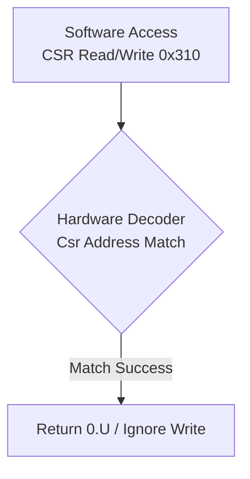
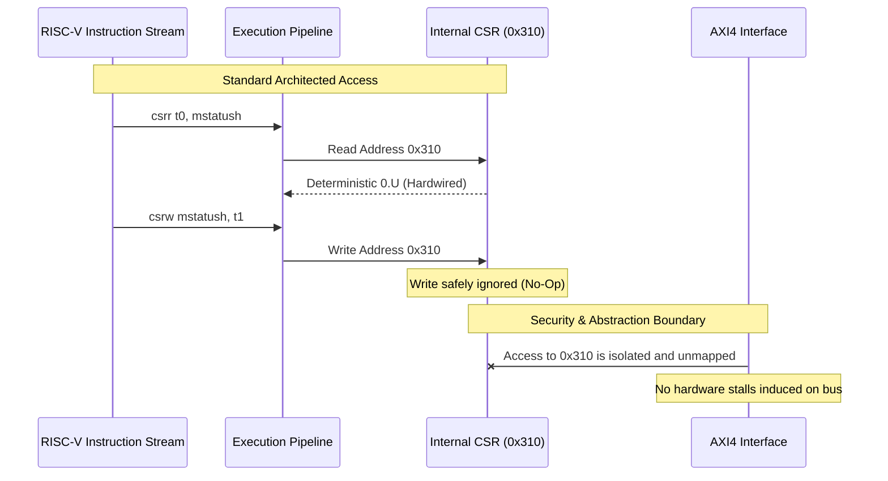

# Hardware/Software Interface

<!--
 Copyright 2026 Google LLC

 Licensed under the Apache License, Version 2.0 (the "License");
 you may not use this file except in compliance with the License.
 You may obtain a copy of the License at

     http://www.apache.org/licenses/LICENSE-2.0

 Unless required by applicable law or agreed to in writing, software
 distributed under the License is distributed on an "AS IS" BASIS,
 WITHOUT WARRANTIES OR CONDITIONS OF ANY KIND, either express or implied.
 See the License for the specific language governing permissions and
 limitations under the License.
-->

> ⚠️ **Disclaimer:** This document was generated or modified by an AI model. While every effort is made to ensure technical accuracy, the underlying source code and hardware RTL implementation remain the absolute source of truth. Use at your own risk.

> **Intended Audience:** SW/Compiler Developers, Hardware Integrators

This document details the interface between software and the CoralNPU hardware, primarily focusing on Control and Status Registers (CSRs) and the initialization sequence.

## External Memory-Mapped CSRs (AXI4)

In addition to internal RISC-V CSRs, the CoralNPU exposes a set of memory-mapped control registers via its AXI4 interface (implemented in `CoreAxiCSR.scala` using explicit Chisel `RegMap` and `RegField` definitions). These registers are primarily used by an external host processor for lifecycle management, state monitoring, and debugging.

| Offset        | Register Name   | Description                                                                                                                               |
| :------------ | :-------------- | :---------------------------------------------------------------------------------------------------------------------------------------- |
| `0x000`       | `resetReg`      | Core control. Bit 0: Active High Reset (`reset`). Bit 1: Active High Clock Gate (`cg`). Initializes to `3` (Reset and Clock Gated).       |
| `0x004`       | `pcStartReg`    | Boot address. The NPU begins fetching from this address when released from reset.                                                         |
| `0x008`       | `statusReg`     | Core status monitoring. Bit 0: `halted`. Bit 1: `fault`.                                                                                  |
| `0x100`       | `kCsrBaseAddr`  | Base address for reading internal NPU operational CSRs externally over AXI4.                                                              |
| `0x800-0x814` | Debug Interface | Registers for interacting with the internal debug module (`DbgReqAddr`, `DbgReqData`, `DbgReqOp`, `DbgRspData`, `DbgRspOp`, `DbgStatus`). |

## Internal Control and Status Registers (CSRs)

The CoralNPU scalar core uses standard RISC-V CSRs with custom extensions to configure and monitor hardware state from within executing software. All mapped CSR addresses are validated by hardware; accessing an unmapped or invalid CSR address triggers an illegal instruction exception (`CsrAddress.safe`).

### Standard Machine-Mode (M-Mode) CSRs

- **mstatus (0x300)**: Machine Status Register. Tracks interrupt enables (`mie`, `mpie`) and the state of floating-point/vector units (`fs`, `vs`).
- **misa (0x301)**: ISA and Extensions. Identifies supported extensions like 'V' (Vector) and 'F' (Single-Precision Float).
- **mie (0x304) / mip (0x344)**: Interrupt Enable / Pending Registers.
- **mtvec (0x305)**: Machine Trap-Vector Base-Address.
- **mscratch (0x340)**: Scratch register for machine mode trap handlers.
- **mepc (0x341)**: Machine Exception Program Counter.
- **mcause (0x342)**: Machine Cause. Stores the exception code.
- **mtval (0x343)**: Machine Trap Value.

### M-Mode Information CSRs

- **mvendorid (0xF11)**: Vendor ID (returns `0x426` for Google).
- **marchid (0xF12)**: Architecture ID (Unimplemented, returns 0).
- **mimpid (0xF13)**: Implementation ID (Unimplemented, returns 0).
- **mhartid (0xF14)**: Hardware Thread ID (returns `p.hartId`).

### Debug & Trigger CSRs

- **dcsr (0x7B0)**: Debug Control and Status Register.
- **dpc (0x7B1)**: Debug Program Counter.
- **dscratch0-dscratch1 (0x7B2-0x7B3)**: Debug Scratch Registers.
- **tselect (0x7A0)**: Trigger Select.
- **tdata1-tdata2 (0x7A1-0x7A2)**: Trigger Data Registers.
- **tinfo (0x7A4)**: Trigger Information (returns `0x01000040`).
- **mpc (0x7E0)**: Machine Program Counter (Debug context).
- **msp (0x7E1)**: Machine Stack Pointer (Debug context).

### Floating-Point & Vector CSRs

- **fcsr (0x003)**: Floating-Point Control and Status Register. Contains `fflags` (0x001) and `frm` (0x002) for tracking exceptions and rounding modes.
- **vstart (0x008)**: Vector start position.
- **vxsat (0x009)**: Fixed-Point Saturate Flag.
- **vxrm (0x00A)**: Fixed-Point Rounding Mode.
- **vl (0xC20)**: Vector Length.
- **vtype (0xC21)**: Vector Type.
- **vlenb (0xC22)**: Vector Length in Bytes (constant 16 bytes for CoralNPU).

### Custom CoralNPU CSRs

- **kisa (0xFC0)**: CoralNPU-specific ISA register.
- **kscm0-kscm4 (0xFC4-0xFD4)**: SCM Revision Information.
- **mcontext0-mcontext7 (0x7C0-0x7C7)**: Context tracking registers.

### Performance Counters

- **mcycle / mcycleh (0xB00 / 0xB80)**: 64-bit cycle counter.
- **minstret / minstreth (0xB02 / 0xB82)**: 64-bit retired instruction counter.

### `mstatush` Register Behavior

The `mstatush` CSR (address `0x310`) is implemented in the CoralNPU RTL to maintain compatibility with certain upstream execution expectations. It explicitly returns `0.U(32.W)` on all reads and safely ignores all writes. It does not trigger an illegal instruction exception when accessed.

## Initialization Sequence

The CoralNPU boot sequence and core initialization are managed externally via the AXI4 CSR interface (`CoreAxiCSR`). The sequence is as follows:

1. **Hardware Reset**: Upon assertion of the system reset, the `resetReg` (offset `0x0`) initializes to `3`, meaning both the core `reset` (bit 0) and `cg` (clock gate, bit 1) are active high. The core is held in reset and its clock is gated.
2. **Boot Address Capture**: The `bootAddrCapture` register initializes to true. On the very first clock cycle post-reset, the `pcStartReg` (offset `0x4`) captures the physical address present on the external hardware `bootAddr` wire. `bootAddrCapture` then transitions to false, locking the value.
3. **Host Override (Optional)**: If the host SoC needs to boot from a different address than the hardwired `bootAddr`, it can perform an AXI4 write to `pcStartReg` (offset `0x4`) to override the boot address.
4. **Memory Initialization**: The external host (or DMA) loads the compiled NPU program into the TCM or system memory.
5. **Core Release**: The host releases the CoralNPU by performing an AXI4 write to `resetReg` (offset `0x0`), writing `0` to clear both the reset and clock gate bits.
6. **Execution**: The core wakes up, the mode defaults to `Machine` (M-mode), and the instruction fetch unit begins fetching from the address stored in `pcStartReg`.

[Source: `hdl/chisel/src/coralnpu/CoreAxiCSR.scala:L101-L125`]
[Citation: The memory-mapped CSR alignment and access control are explicitly enforced via Chisel `RegMap` and `RegField` definitions within `CoreAxiCSR.scala`.]

## CoreAxiCSR Reset and Clock Gate Controls

As detailed in the external register map above, the `CoreAxiCSR` module provides the external interface to manage the core's reset sequence. Specifically, the `resetReg` (offset `0x0`) controls both the `reset` (Bit 0) and `cg` (Clock Gate, Bit 1) signals. Upon system initialization, the core is held in reset and clock-gated (value `3`). The host must write `0` to this register to release the NPU for execution.

[Source: `hdl/chisel/src/coralnpu/CoreAxiCSR.scala:L50,L151-L157`]

<!-- mdformat off -->
<!-- prettier-ignore-start -->

--------------------------------------------------------------------------------

**Provenance & Traceability** - **Verified As Of:** 2026-07-05 - **Upstream Commit:** f5f6c88d3dff8cb198cd89420919b6863667f3e0 - **Primary Source(s):** `hdl/chisel/src/coralnpu/scalar/Csr.scala:L56,L337,L414,L481`, `hdl/chisel/src/coralnpu/CoreAxiCSR.scala:L50-L54,L101-L125` - **Disclaimer:** AI-generated/assisted; RTL is the source of truth.

<!-- prettier-ignore-end -->
<!-- mdformat on -->

> **Traceability:** Generated by Gemini. Derived from upstream commit 9a1e82634c2b0f3d42310f89cd1484d8f3302ec9.
