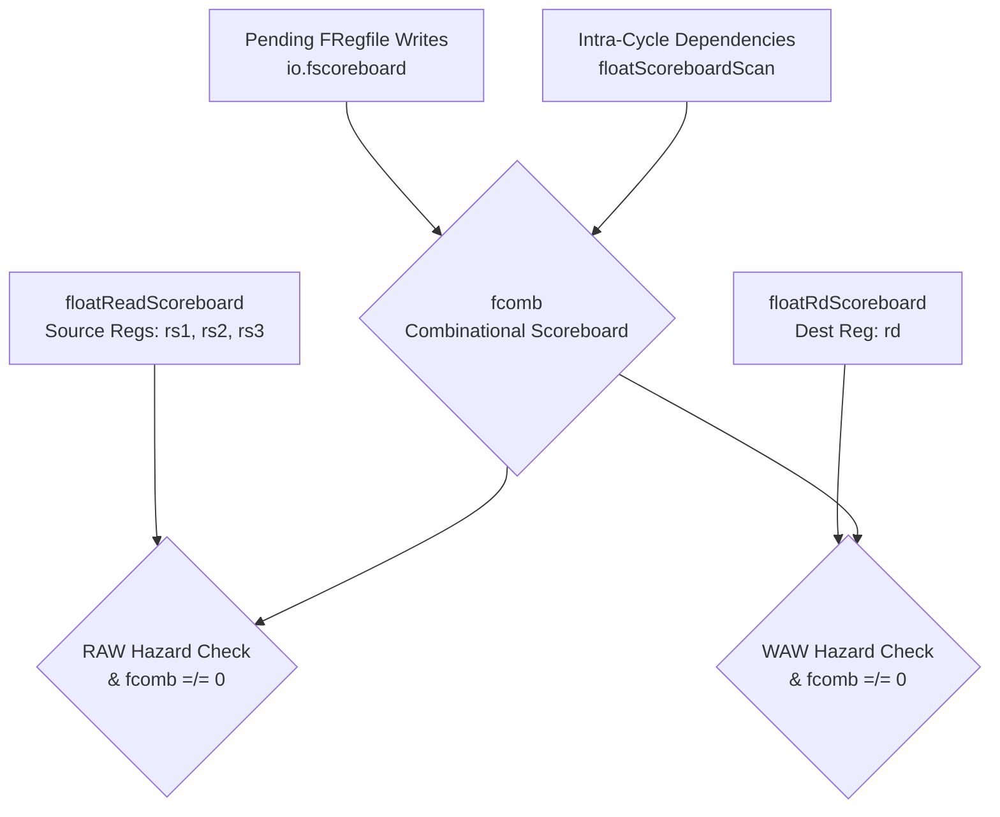
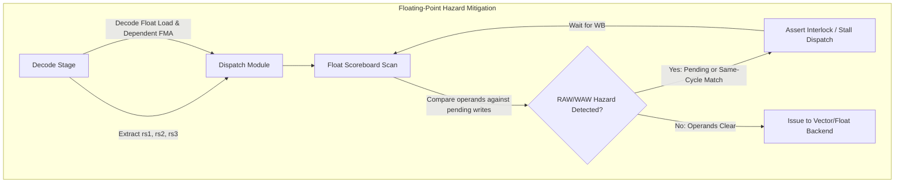

# CoralNPU Dispatch Rules

<!--
 Copyright 2026 Google LLC

 Licensed under the Apache License, Version 2.0 (the "License");
 you may not use this file except in compliance with the License.
 You may obtain a copy of the License at

     http://www.apache.org/licenses/LICENSE-2.0

 Unless required by applicable law or agreed to in writing, software
 distributed under the License is distributed on an "AS IS" BASIS,
 WITHOUT WARRANTIES OR CONDITIONS OF ANY KIND, either express or implied.
 See the License for the specific language governing permissions and
 limitations under the License.
-->

> ⚠️ **Disclaimer:** This document was generated or modified by an AI model. While every effort is made to ensure technical accuracy, the underlying source code and hardware RTL implementation remain the absolute source of truth. Use at your own risk.

> **Intended Audience:** Hardware Developers

The following describes the general rules used to determine which instructions can
be dispatched in the CoralNPU core. The Dispatch unit operates based on the scoreboard status.

## Interfaces

### Port Definitions

| Signal Name                         | Direction | Type                                                           | Description                                  |
| :---------------------------------- | :-------- | :------------------------------------------------------------- | :------------------------------------------- |
| `io.halted`                         | Input     | `Bool`                                                         | Core halted control.                         |
| `io.mactive`                        | Input     | `Bool`                                                         | Memory active status.                        |
| `io.lsuActive`                      | Input     | `Bool`                                                         | LSU active status.                           |
| `io.scoreboard.regd`                | Input     | `UInt(32.W)`                                                   | Scalar scoreboard register destination.      |
| `io.scoreboard.comb`                | Input     | `UInt(32.W)`                                                   | Scalar scoreboard combinational hazard.      |
| `io.fscoreboard`                    | Input     | `UInt(32.W)`                                                   | Floating-point scoreboard (Optional).        |
| `io.branchTaken`                    | Input     | `Bool`                                                         | Branch taken status.                         |
| `io.csrFault`                       | Output    | `Vec(p.instructionLanes, Bool)`                                | CSR fault status per lane.                   |
| `io.jalFault`                       | Output    | `Vec(p.instructionLanes, Bool)`                                | JAL fault status per lane.                   |
| `io.jalrFault`                      | Output    | `Vec(p.instructionLanes, Bool)`                                | JALR fault status per lane.                  |
| `io.bxxFault`                       | Output    | `Vec(p.instructionLanes, Bool)`                                | Branch fault status per lane.                |
| `io.undefFault`                     | Output    | `Vec(p.instructionLanes, Bool)`                                | Undefined instruction fault per lane.        |
| `io.rvvFault`                       | Output    | `Vec(p.instructionLanes, Bool)`                                | RVV fault status per lane (Optional).        |
| `io.bruTarget`                      | Output    | `Vec(p.instructionLanes, UInt)`                                | BRU target address per lane.                 |
| `io.jalrTarget`                     | Input     | `Vec(p.instructionLanes, RegfileBranchTargetIO)`               | JALR target from register file.              |
| `io.interlock`                      | Input     | `Bool`                                                         | Pipeline interlock signal.                   |
| `io.inst`                           | Input     | `Vec(p.instructionLanes, Decoupled(FetchInstruction))`         | Decoded instructions input from Fetch.       |
| `io.rs1Read`                        | Output    | `Vec(p.instructionLanes, RegfileReadAddrIO)`                   | RS1 read address to register file.           |
| `io.rs1Set`                         | Output    | `Vec(p.instructionLanes, RegfileReadSetIO)`                    | RS1 set value to register file.              |
| `io.rs2Read`                        | Output    | `Vec(p.instructionLanes, RegfileReadAddrIO)`                   | RS2 read address to register file.           |
| `io.rs2Set`                         | Output    | `Vec(p.instructionLanes, RegfileReadSetIO)`                    | RS2 set value to register file.              |
| `io.rdMark`                         | Output    | `Vec(p.instructionLanes, RegfileWriteAddrIO)`                  | RD write address to register file.           |
| `io.busRead`                        | Output    | `Vec(p.instructionLanes, RegfileBusAddrIO)`                    | Bus read address to register file.           |
| `io.rdMark_flt`                     | Output    | `RegfileWriteAddrIO`                                           | Floating-point RD write address (Optional).  |
| `io.rvvRdMark`                      | Output    | `Vec(p.instructionLanes, RegfileWriteAddrIO)`                  | RVV RD write address (Optional).             |
| `io.frs1Read`                       | Output    | `Vec(p.instructionLanes, RegfileReadAddrIO)`                   | Floating-point RS1 read address (Optional).  |
| `io.alu`                            | Output    | `Vec(p.instructionLanes, Valid(AluCmd))`                       | ALU command output.                          |
| `io.bru`                            | Output    | `Vec(p.instructionLanes, Valid(BruCmd))`                       | BRU command output.                          |
| `io.csr`                            | Output    | `Valid(CsrCmd)`                                                | CSR command output.                          |
| `io.lsu`                            | Output    | `Vec(p.instructionLanes, Decoupled(LsuCmd))`                   | LSU command output.                          |
| `io.lsuQueueCapacity`               | Input     | `UInt(3.W)`                                                    | LSU queue capacity.                          |
| `io.mlu`                            | Output    | `Vec(p.instructionLanes, Decoupled(MluCmd))`                   | Multiplier command output.                   |
| `io.dvu`                            | Output    | `Vec(p.instructionLanes, Decoupled(DvuCmd))`                   | Divide command output.                       |
| `io.rvv`                            | Output    | `Vec(p.instructionLanes, Decoupled(RvvCompressedInstruction))` | RVV instruction output (Optional).           |
| `io.rvvState`                       | Input     | `Valid(RvvConfigState)`                                        | RVV config state (Optional).                 |
| `io.rvvIdle`                        | Input     | `Bool`                                                         | RVV idle status (Optional).                  |
| `io.rvvQueueCapacity`               | Input     | `UInt(4.W)`                                                    | RVV queue capacity (Optional).               |
| `io.float`                          | Output    | `Decoupled(FloatInstruction)`                                  | Float instruction output (Optional).         |
| `io.csrFrm`                         | Input     | `UInt(3.W)`                                                    | CSR floating-point rounding mode (Optional). |
| `io.fbusPortAddr`                   | Output    | `UInt(5.W)`                                                    | Float bus port address (Optional).           |
| `io.retirement_buffer_nSpace`       | Input     | `UInt`                                                         | Retirement buffer available space.           |
| `io.retirement_buffer_empty`        | Input     | `Bool`                                                         | Retirement buffer empty status.              |
| `io.retirement_buffer_trap_pending` | Input     | `Bool`                                                         | Retirement buffer trap pending status.       |
| `io.single_step`                    | Input     | `Bool`                                                         | Single step mode enable.                     |
| `io.debug_mode`                     | Input     | `Bool`                                                         | Debug mode enable.                           |
| `io.branch`                         | Output    | `Vec(p.instructionLanes, Bool)`                                | Branch instruction detected per lane.        |
| `io.jump`                           | Output    | `Vec(p.instructionLanes, Bool)`                                | Jump instruction detected per lane.          |

## In-order

If an instruction at address `n` cannot be dispatched, instructions at `n+4` and subsequent addresses are not considered for dispatch.

## Hazard Handling

- RAW / WAW Hazards: Tracked via scoreboard.
- WAR Hazards: Prevented by register file read timing (operands read in the cycle following dispatch).

### Floating-Point Scoreboard Hazard Tracking

The dispatch unit uses a dedicated combinational scoreboard (`fcomb`) for floating-point instructions to track intra-cycle and inter-cycle hazards across the dispatch lanes.

#### Float Intra-Cycle RAW Hazard Tracking Logic

## Execution Unit Constraints

- MLU: Maximum 1 multiply instruction per cycle.
- DVU: Single non-pipelined execution unit with backpressure support.
- LSU: Maximum 1 memory instruction per cycle.
- ALU/BRU: Supported across all execution lanes.

## Control Flow

CoralNPU does not dispatch past the following jump instructions:
`jal`, `jalr`, `ebreak`, `ecall`, `mret`, `wfi`.

## Special Instructions

The following instructions must execute in the first dispatch slot, with no other instructions dispatched in the same cycle:
`csrrw`, `csrrs`, `csrrc`, `ebreak`, `ecall`, `mret`, `fence`, `fenci`, `wfi`.

<!-- prettier-ignore -->
--------------------------------------------------------------------------------

**Provenance & Traceability** - **Verified As Of:** 2026-07-22 - **Upstream Commit:** 5c2647afd951f70d6244ea06b5a8b7fa1fdf2918 - **Primary Source(s):** `hdl/chisel/src/coralnpu/scalar/Decode.scala:L216`, `hdl/chisel/src/coralnpu/scalar/Decode.scala:L301` - **Disclaimer:** AI-generated/assisted; RTL is the source of truth.
