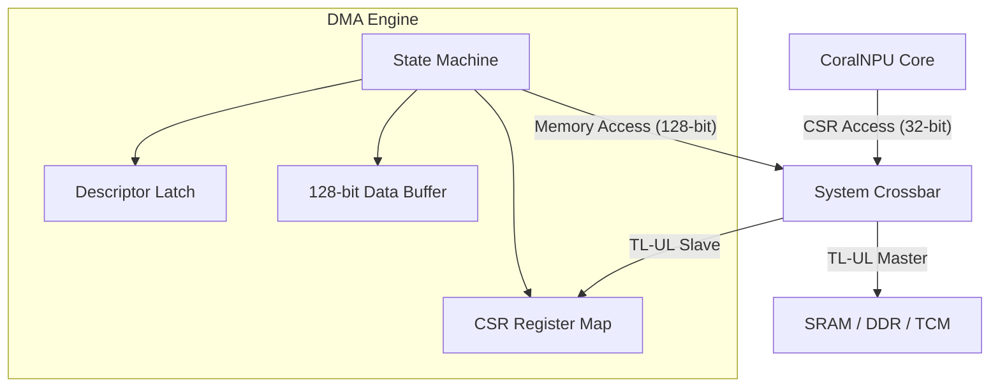

<!--
 Copyright 2026 Google LLC

 Licensed under the Apache License, Version 2.0 (the "License");
 you may not use this file except in compliance with the License.
 You may obtain a copy of the License at

     http://www.apache.org/licenses/LICENSE-2.0

 Unless required by applicable law or agreed to in writing, software
 distributed under the License is distributed on an "AS IS" BASIS,
 WITHOUT WARRANTIES OR CONDITIONS OF ANY KIND, either express or implied.
 See the License for the specific language governing permissions and
 limitations under the License.
-->
# Direct Memory Access (DMA) Engine

> ⚠️ **Disclaimer:** This document was generated or modified by an AI model. While every effort is made to ensure technical accuracy, the underlying source code and hardware RTL implementation remain the absolute source of truth. Use at your own risk.

> **Intended Audience:** HW Devs, SW/Compiler Devs

The Direct Memory Access (DMA) engine is a single-channel, linked-list descriptor-based DMA controller designed to offload bulk data movement tasks from the core CPU. It operates as both a TileLink-UL (TL-UL) host (issuing read/write transactions) and a TL-UL device (accepting configuration commands via CSRs).

The DMA engine is critical for efficient data orchestration, such as streaming model weights from off-chip DDR or on-chip SRAM into tightly-coupled memories (TCMs) without stalling the execution pipeline.

## Architecture

The DMA engine features two distinct TileLink-UL interfaces:

- **Host Port (128-bit)**: Used for issuing high-bandwidth `Get` and `PutFullData` transactions on the system crossbar to read from source and write to destination addresses.
- **Device Port (32-bit)**: Used by the CPU to program the DMA's Control and Status Registers (CSRs).

The engine processes a linked list of 32-byte descriptors stored in memory. Each descriptor defines a single transfer operation, including source/destination addresses, length, and optional peripheral flow control.

### Block Diagram (Conceptual)

## Register Map

The DMA engine is mapped to the peripheral address space at base `0x40050000`.

| Offset | Name          | Access | Reset | Description                                        |
| :----- | :------------ | :----- | :---- | :

--------------------------------------------------------------------------------

**Provenance & Traceability**
- **Verified As Of:** 2026-07-25
- **Upstream Commit:** [2be7892532110edbcd0ca4e7ff56e4360a428df7](https://github.com/google/coralnpu/commit/2be7892532110edbcd0ca4e7ff56e4360a428df7)
- **Primary Source(s):** `hdl/chisel/src/bus/DmaEngine.scala` (Lines 38-71, 128-270) - **Disclaimer:** AI-generated/assisted; RTL is the source of truth.
- **Disclaimer:** AI-generated/assisted; RTL is the source of truth.

> **Traceability:** Generated by Gemini. Derived from upstream commit 6a8cc54a67fb4ca7ecda116453fbdc4a97994ebf.
