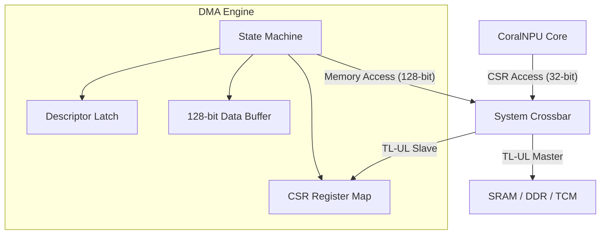

<!--
 Copyright 2026 Google LLC

 Licensed under the Apache License, Version 2.0 (the "License");
 you may not use this file except in compliance with the License.
 You may obtain a copy of the License at

     http://www.apache.org/licenses/LICENSE-2.0

 Unless required by applicable law or agreed to in writing, software
 distributed under the License is distributed on an "AS IS" BASIS,
 WITHOUT WARRANTIES OR CONDITIONS OF ANY KIND, either express or implied.
 See the License for the specific language governing permissions and
 limitations under the License.
-->
# Direct Memory Access (DMA) Engine

> ⚠️ **Disclaimer:** This document was generated or modified by an AI model. While every effort is made to ensure technical accuracy, the underlying source code and hardware RTL implementation remain the absolute source of truth. Use at your own risk.

> **Intended Audience:** Hardware Developers, SW/Compiler Developers

The Direct Memory Access (DMA) engine is a single-channel, linked-list descriptor-based DMA controller designed to offload bulk data movement tasks from the core CPU. It operates as both a TileLink-UL (TL-UL) host (issuing read/write transactions) and a TL-UL device (accepting configuration commands via CSRs).

The DMA engine is critical for efficient data orchestration, such as streaming model weights from off-chip DDR or on-chip SRAM into tightly-coupled memories (TCMs) without stalling the execution pipeline.

## Architecture

The DMA engine features two distinct TileLink-UL interfaces:

- **Host Port (128-bit)**: Used for issuing high-bandwidth `Get` and `PutFullData` transactions on the system crossbar to read from source and write to destination addresses.
- **Device Port (32-bit)**: Used by the CPU to program the DMA's Control and Status Registers (CSRs).

The engine processes a linked list of 32-byte descriptors stored in memory. Each descriptor defines a single transfer operation, including source/destination addresses, length, and optional peripheral flow control.

### Block Diagram (Conceptual)

## Register Map

The DMA engine is mapped to the peripheral address space at base `0x40050000`.

| Offset | Name          | Access | Reset | Description                                        |
| :----- | :------------ | :----- | :---- | :------------------------------------------------- |
| `0x00` | `CTRL`        | RW     | `0x0` | Control register (Enable, Start, Abort).           |
| `0x04` | `STATUS`      | RO     | `0x0` | Status register (Busy, Done, Error Code).          |
| `0x08` | `DESC_ADDR`   | RW     | `0x0` | Address of the first descriptor in memory.         |
| `0x0C` | `CUR_DESC`    | RO     | `0x0` | Address of the currently executing descriptor.     |
| `0x10` | `XFER_REMAIN` | RO     | `0x0` | Number of bytes remaining in the current transfer. |

### Register Fields

#### CTRL (0x00)

- `[0] enable`: Master enable for the DMA engine.
- `[1] start`: Write 1 to start processing the descriptor chain. Self-clearing.
- `[2] abort`: Write 1 to immediately halt the DMA engine and return to IDLE.

#### STATUS (0x04)

- `[0] busy`: Set when the DMA is actively processing a descriptor.
- `[1] done`: Set when the DMA completes a descriptor chain.
- `[2] error`: Set if a TileLink error or abort occurs.
- `[7:4] error_code`: Indicates the failure state:
  - `0`: No error.
  - `1`: Descriptor Fetch Error.
  - `2`: Poll Request Error.
  - `3`: Data Read Error.
  - `4`: Data Write Error.
  - `5`: User Abort.

## Descriptor Format

Descriptors are 32 bytes and must be 32-byte aligned. The engine fetches them in two 128-bit beats via its host port.

| Offset | Field        | Bits      | Description                                             |
| :----- | :----------- | :-------- | :------------------------------------------------------ |
| `0x00` | `src_addr`   | `[31:0]`  | Source base address.                                    |
| `0x04` | `dst_addr`   | `[31:0]`  | Destination base address.                               |
| `0x08` | `xfer_len`   | `[23:0]`  | Total transfer length in bytes (Max 16MB).              |
|        | `xfer_width` | `[26:24]` | Beat size: `log2(bytes)`. Supported: 0 (1B) to 4 (16B). |
|        | `src_fixed`  | `[27]`    | If 1, the source address does not increment.            |
|        | `dst_fixed`  | `[28]`    | If 1, the destination address does not increment.       |
|        | `poll_en`    | `[29]`    | Enables peripheral flow control (status polling).       |
| `0x0C` | `next_desc`  | `[31:0]`  | Pointer to the next descriptor. `0x0` ends the chain.   |
| `0x10` | `poll_addr`  | `[31:0]`  | Peripheral status register address to poll.             |
| `0x14` | `poll_mask`  | `[31:0]`  | Bitmask for the polled value.                           |
| `0x18` | `poll_value` | `[31:0]`  | Expected value for the masked status.                   |

## Peripheral Flow Control (Polling)

The DMA supports basic flow control by polling a peripheral status register before each data beat. This allows the DMA to pace transfers to the speed of peripherals (e.g., waiting for an SPI TX FIFO to have space) without dedicated hardware handshake lines.

When `poll_en` is set, the DMA enters the `sPollReq` state before each `sXferReadReq`. It will loop between `sPollReq` and `sPollResp` until the condition `(data & poll_mask) == poll_value` is met.

## State Machine

The DMA engine's operation is governed by a synchronous state machine:

1.  **sIdle**: Waiting for `start` signal.
2.  **sFetchDesc0 / sFetchDesc1**: Fetching the 32-byte descriptor from memory.
3.  **sPollCheck**: Checking if status polling is required for this beat.
4.  **sPollReq / sPollResp**: Executing the peripheral status poll.
5.  **sXferReadReq / sXferReadResp**: Reading data from the source address.
6.  **sXferWriteReq / sXferWriteResp**: Writing data to the destination address.
7.  **sDone**: Cleaning up and signaling completion.

## Implementation Details

- **Host Interface**: 128-bit TL-UL Host. Issues `Get` and `PutFullData` transactions.
- **Device Interface**: 32-bit TL-UL Device.
- **Data Buffer**: Internal 128-bit register (`xfer.data_buf`) stores data between read and write beats.
- **Traceability**: Implementation is localized to a single Chisel module.

## Alignment and Strides

- **Descriptor Alignment**: Descriptors are 32 bytes in length and MUST be 32-byte aligned in memory. This is critical for the `sFetchDesc0` and `sFetchDesc1` states (hdl/chisel/src/bus/DmaEngine.scala:59-71).
- **Data Beat Alignment**: Data transfer beats are defined by `xfer_width`. The engine supports beat sizes from 1 byte (`xfer_width=0`) up to 16 bytes (`xfer_width=4`) (hdl/chisel/src/bus/DmaEngine.scala:128).
- **Stride Control**: The DMA does not directly support explicit strides in the descriptor. Strided access is achieved by configuring multiple linked descriptors or by setting `src_fixed` or `dst_fixed` to prevent incrementing the address for specific source or destination buffers (hdl/chisel/src/bus/DmaEngine.scala:65-66, 269-270).

---

**Provenance & Traceability** - **Verified As Of:** 2026-07-22 - **Upstream Commit:** c9d3cd8816886ced4a935722205fd47aeb72eed9 - **Primary Source(s):** `hdl/chisel/src/bus/DmaEngine.scala` (Lines 38-71, 128-270) - **Disclaimer:** AI-generated/assisted; RTL is the source of truth.

> **Traceability:** Generated by Gemini. Derived from upstream commit f05a63aa421b1c7880e6fb2309e5e2c0e35607c3.
