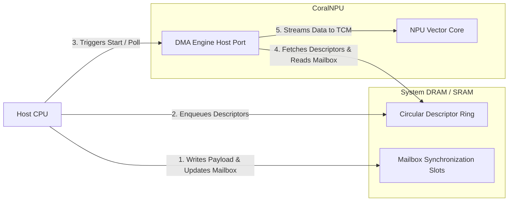

# Command Ring Buffer & Execution Queue Architecture

> **Intended Audience:** SW/Compiler Developers, Hardware Integrators
> ⚠️ **Disclaimer:** This document was generated or modified by an AI model. While every effort is made to ensure technical accuracy, the underlying source code and hardware RTL implementation remain the absolute source of truth. Use at your own risk.

This document details the software-managed Command Ring Buffer and Execution Queue programming model on the CoralNPU. Because the CoralNPU IP does not implement a dedicated hardware-managed ring buffer in its silicon, command orchestration, data streaming, and compute dispatch queues are fully managed in software utilizing chained descriptor lists processed asynchronously by the DMA Engine.

---

## 1. Execution Model

The host CPU and the CoralNPU DMA Engine operate in an asynchronous, decoupled Producer-Consumer relationship.



1. **Producer (Host CPU)**: Allocates a circular array of 32-byte descriptors in memory, prepares data transfers (e.g., streaming inputs, filter weights, or instruction payloads), updates synchronization mailboxes, and manages queue pointers (`head` and `tail`).
2. **Consumer (DMA Engine)**: Asynchronously fetches and parses the descriptors, performs status polling if enabled, executes the requested high-bandwidth memory transfers between system memory and tightly-coupled memory (TCM), and chains to the next descriptor.

---

## 2. Descriptor Memory Layout (Software View)

To execute transfers, software must construct 32-byte descriptors in memory. Descriptors must be **32-byte aligned** to ensure atomic fetching via the 128-bit TileLink-UL (TL-UL) host port. Each descriptor is composed of two 16-byte (128-bit) parts.

```
       Part 0 (Offsets 0x00 - 0x0F): Execution Parameters
       +---------------------------------------------------------------+
0x00:  |                     src_addr [31:0]                           |
       +---------------------------------------------------------------+
0x04:  |                     dst_addr [31:0]                           |
       +---------------------------------------------------------------+
0x08:  | Rsvd[31:30] | poll_en[29] | dst_fix[28] | src_fix[27] | ...   |
       | ... width[26:24]          |          xfer_len [23:0]          |
       +---------------------------------------------------------------+
0x0C:  |                     next_desc [31:0]                          |
       +---------------------------------------------------------------+

       Part 1 (Offsets 0x10 - 0x1F): Hardware Status Polling (Optional)
       +---------------------------------------------------------------+
0x10:  |                     poll_addr [31:0]                          |
       +---------------------------------------------------------------+
0x14:  |                     poll_mask [31:0]                          |
       +---------------------------------------------------------------+
0x18:  |                     poll_value [31:0]                         |
       +---------------------------------------------------------------+
0x1C:  |                     padding [31:0] (Write as 0)               |
       +---------------------------------------------------------------+
```

### Bit-Level Specification

#### Part 0: Transfer Parameters (128 bits)

| Word | Offset | Field | Bits | Type | Description |
| :--- | :----- | :---- | :--- | :--- | :---------- |
| **0** | `0x00` | `src_addr` | `[31:0]` | UInt32 | Source base address. Must align to beat size. |
| **1** | `0x04` | `dst_addr` | `[31:0]` | UInt32 | Destination base address. Must align to beat size. |
| **2** | `0x08` | `xfer_len` | `[23:0]` | UInt24 | Total transfer size in bytes. Max `16,777,215` bytes. |
| | | `xfer_width` | `[26:24]` | UInt3 | Log2 beat size: `0` (1B), `1` (2B), `2` (4B), `3` (8B), `4` (16B). |
| | | `src_fixed` | `[27]` | Bool | `1` = Source address does not increment (e.g., streaming from FIFO). |
| | | `dst_fixed` | `[28]` | Bool | `1` = Destination address does not increment (e.g., streaming to FIFO). |
| | | `poll_en` | `[29]` | Bool | `1` = Enable peripheral polling (Part 1 fields are read/active). |
| | | `reserved` | `[31:30]` | UInt2 | Write as `0`. |
| **3** | `0x0C` | `next_desc` | `[31:0]` | UInt32 | Next descriptor memory address. `0x00000000` terminates chain. |

#### Part 1: Status Polling (128 bits, read only if `poll_en = 1` and `poll_addr != 0`)

| Word | Offset | Field | Bits | Type | Description |
| :--- | :----- | :---- | :--- | :--- | :---------- |
| **4** | `0x10` | `poll_addr` | `[31:0]` | UInt32 | Peripheral register or memory mailbox address to poll. |
| **5** | `0x14` | `poll_mask` | `[31:0]` | UInt32 | Bitmask applied to polled data: `masked_data = read_data & poll_mask`. |
| **6** | `0x18` | `poll_value` | `[31:0]` | UInt32 | Expected value. DMA stalls until `masked_data == poll_value`. |
| **7** | `0x1C` | `padding` | `[31:0]` | UInt32 | Reserved padding. Write as `0`. |

---

## 3. Register Interface Definitions (Software View)

The DMA Engine provides five memory-mapped Control and Status Registers (CSRs) starting at base address `0x40050000` via its 32-bit TileLink-UL device port.

| Offset | Name | Type | Reset | Description |
| :----- | :--- | :--- | :---- | :---------- |
| `0x00` | `CTRL` | RW | `0x0` | Control and execution register. |
| `0x04` | `STATUS` | RO | `0x0` | Execution status and error reporting. |
| `0x08` | `DESC_ADDR`| RW | `0x0` | Descriptor entry point address. Must be 32-byte aligned. |
| `0x0C` | `CUR_DESC` | RO | `0x0` | Current active descriptor memory address. |
| `0x10` | `XFER_REMAIN`| RO | `0x0` | Number of bytes remaining in the current active transfer. |

### Register Field Specifications

#### CTRL (0x00)
- `[0] enable` (RW): Master enable. Must be set to `1` to process any transfers.
- `[1] start` (WO): Write `1` to initiate processing of the descriptor chain starting at `DESC_ADDR`. Self-clearing.
- `[2] abort` (WO): Write `1` to immediately halt the DMA, discarding the current transfer and returning to IDLE. Self-clearing.

#### STATUS (0x04)
- `[0] busy` (RO): `1` if the DMA is actively fetching descriptors or executing transfers.
- `[1] done` (RO): `1` when the DMA successfully completes processing of a descriptor chain (reaches `next_desc == 0`).
- `[2] error` (RO): `1` if a TileLink-UL bus transaction error or software abort occurs.
- `[7:4] error_code` (RO): Specifies the exact hardware failure:
  - `0x0`: No error.
  - `0x1`: Descriptor Fetch Error (bus failure fetching Part 0 or Part 1).
  - `0x2`: Poll Request Error (bus failure reading status poll address).
  - `0x3`: Data Read Error (bus failure reading source address).
  - `0x4`: Data Write Error (bus failure writing destination address).
  - `0x5`: User Abort (execution interrupted via `CTRL.abort`).

---

## 4. Synchronization Protocols

To manage execution queues without host CPU interrupt overhead or deadlocks, software implements three core synchronization patterns.

### 4.1. Circular Command Ring Orchestration
To maintain a continuous circular execution queue:
1. Software pre-allocates an array of $N$ descriptors. Each descriptor's `next_desc` is initialized pointing to the next descriptor in memory, with the $N$-th descriptor's `next_desc` pointing back to the 1st descriptor, closing the ring.
2. Software maintains `head` (write index) and `tail` (read index) pointers in CPU memory.
3. Each descriptor has `poll_en` enabled, pointing to a dedicated `ready_flag` in a synchronization mailbox array in memory.
4. When enqueuing a new command:
   - Software writes transfer parameters (`src_addr`, `dst_addr`, `xfer_len`, `xfer_width`, `next_desc`) into `ring[head]`.
   - Software sets the polling parameters to block until `mailbox[head] == 1`.
   - Software executes a **memory barrier** (`fence rw, rw`) to guarantee descriptor fields are flushed and visible to the DMA.
   - Software writes `1` to `mailbox[head]`, unblocking the DMA.
   - Software increments the `head` pointer: `head = (head + 1) % N`.

### 4.2. Polling-Based Hardware Synchronization
Status polling enables backpressure and pacing. By setting `poll_en = 1`, the DMA FSM enters the `sPollReq` state before executing each data transfer beat. The hardware automatically blocks, issuing read requests over TL-UL to `poll_addr` and masking the result, executing zero data movement until the condition is met. This:
- Decouples host scheduling from NPU readiness.
- Allows pacing transfers to match peripheral FIFO levels (e.g., checking if UART/SPI TX FIFO is not full) or waiting for NPU Core computation to finish writing a completion flag.

### 4.3. Coherence and Pipeline Interlocking
When the DMA streams new data (e.g., weights or vector commands) directly into the Vector Core's Tightly Coupled Memory (TCM), the host CPU must ensure memory coherence before kicking off computation:
- **DMA Complete Interlock**: Software polls `STATUS.busy` until it transitions to `0` or inspects `CUR_DESC` to verify the descriptor has been cleared.
- **Pipeline Barrier**: The CPU executes a RISC-V `fence` instruction to serialize the DMA writeback before dispatching dependent instructions to the Vector Backend.

---

## 5. Software Programming Examples

### 5.1. Initializing a Single Linked Descriptor

The following C routine demonstrates how to construct and launch a basic linked DMA transfer:

```c
#include <stdint.h>
#include <stdbool.h>

// Define the 32-byte physical DMA descriptor structure
typedef struct __attribute__((packed, aligned(32))) {
  // Part 0
  uint32_t src_addr;
  uint32_t dst_addr;
  uint32_t flags;
  uint32_t next_desc;
  // Part 1
  uint32_t poll_addr;
  uint32_t poll_mask;
  uint32_t poll_value;
  uint32_t padding;
} DmaDescriptor;

// DMA CSR Register Definitions
#define DMA_BASE       0x40050000
#define DMA_CTRL       (*(volatile uint32_t*)(DMA_BASE + 0x00))
#define DMA_STATUS     (*(volatile uint32_t*)(DMA_BASE + 0x04))
#define DMA_DESC_ADDR  (*(volatile uint32_t*)(DMA_BASE + 0x08))

void launch_single_transfer(uint32_t src, uint32_t dst, uint32_t len, uint8_t width) {
  static DmaDescriptor desc __attribute__((aligned(32)));

  // Setup Part 0
  desc.src_addr = src;
  desc.dst_addr = dst;
  desc.flags = (len & 0xFFFFFF) |
               ((width & 0x07) << 24) |
               (0 << 27) |  // src_fixed = false
               (0 << 28) |  // dst_fixed = false
               (0 << 29);   // poll_en = false
  desc.next_desc = 0x00000000; // End of chain

  // Ensure descriptor memory is synchronized and visible to DMA
  __asm__ volatile ("fence rw, rw" ::: "memory");

  // Load entry point and kick off DMA
  DMA_DESC_ADDR = (uint32_t)&desc;
  DMA_CTRL = 0x3; // Set Enable (Bit 0) and Start (Bit 1)
}
```

### 5.2. Setting Up an Active Circular Command Ring with Polling

This example configures a 4-slot circular command ring where the NPU automatically blocks on each slot until software updates the associated mailbox slot flag:

```c
#define RING_SIZE 4

DmaDescriptor cmd_ring[RING_SIZE] __attribute__((aligned(32)));
volatile uint32_t mailbox[RING_SIZE] __attribute__((aligned(32))) = {0};

uint32_t head = 0;

void init_circular_ring(void) {
  for (int i = 0; i < RING_SIZE; i++) {
    // Link next descriptor pointer in a circular loop
    cmd_ring[i].next_desc = (uint32_t)&cmd_ring[(i + 1) % RING_SIZE];

    // Configure mailbox polling for each descriptor slot
    cmd_ring[i].poll_addr = (uint32_t)&mailbox[i];
    cmd_ring[i].poll_mask = 0x00000001; // Check bit 0
    cmd_ring[i].poll_value = 0x00000001; // Block until set to 1
  }
}

void enqueue_ring_transfer(uint32_t src, uint32_t dst, uint32_t len, uint8_t width) {
  // Setup transfer parameters on the head slot
  cmd_ring[head].src_addr = src;
  cmd_ring[head].dst_addr = dst;
  cmd_ring[head].flags = (len & 0xFFFFFF) |
                         ((width & 0x07) << 24) |
                         (0 << 27) |  // src_fixed
                         (0 << 28) |  // dst_fixed
                         (1 << 29);   // poll_en = true

  // Ensure fields are written in memory before updating mailbox flag
  __asm__ volatile ("fence rw, rw" ::: "memory");

  // Write "1" to unblock the DMA on this slot
  mailbox[head] = 1;

  // Advance local head pointer
  head = (head + 1) % RING_SIZE;
}
```

---

<!-- mdformat off -->
<!-- prettier-ignore -->
--------------------------------------------------------------------------------

**Provenance & Traceability** - **Verified As Of:** 2026-07-10 - **Upstream Commit:** c9d3cd8816886ced4a935722205fd47aeb72eed9 - **Primary Source(s):** `hdl/chisel/src/bus/DmaEngine.scala` (Lines 38-118, 165-198), `hdl/chisel/src/bus/DmaEngineTest.scala` (Lines 78-106) - **Disclaimer:** AI-generated/assisted; RTL is the source of truth.

<!-- mdformat on -->
