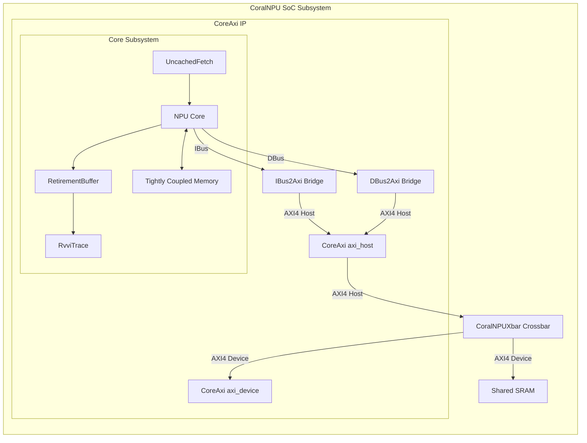
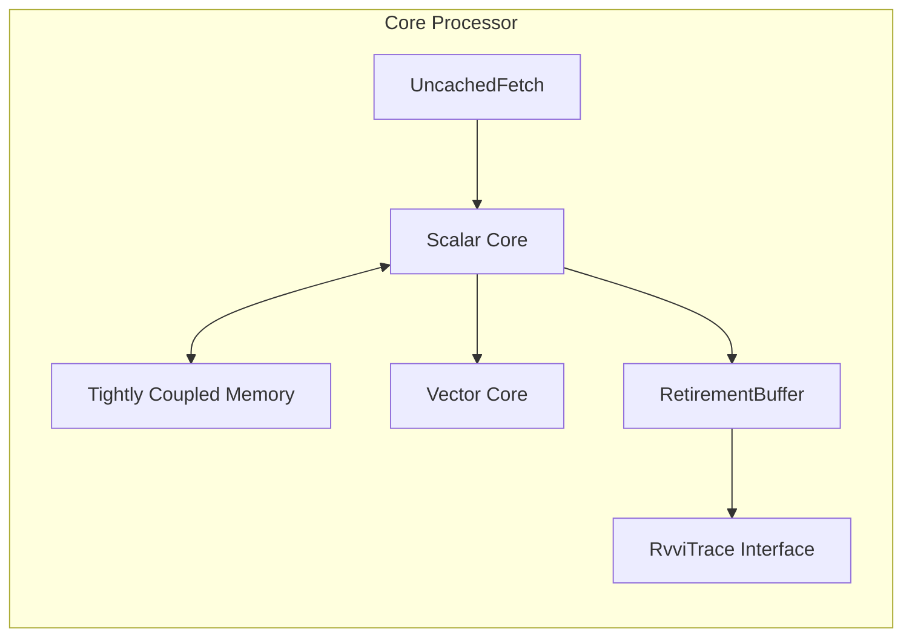

<!--
 Copyright 2026 Google LLC

 Licensed under the Apache License, Version 2.0 (the "License");
 you may not use this file except in compliance with the License.
 You may obtain a copy of the License at

     http://www.apache.org/licenses/LICENSE-2.0

 Unless required by applicable law or agreed to in writing, software
 distributed under the License is distributed on an "AS IS" BASIS,
 WITHOUT WARRANTIES OR CONDITIONS OF ANY KIND, either express or implied.
 See the License for the specific language governing permissions and
 limitations under the License.
-->

# CoralNPU Top-Level Subsystem

> ⚠️ **Disclaimer:** This document was generated or modified by an AI model.
> While every effort is made to ensure technical accuracy, the underlying source
> code and hardware RTL implementation remain the absolute source of truth. Use
> at your own risk.

> **Intended Audience:** System Integrators, Hardware Developers

This document provides a unified overview of the CoralNPU block relationships,
memory hierarchy, and high-level system boundaries. The core IP interacts with
external systems exclusively through the AXI4 interface. External integration
details are out-of-scope for this document.

## Architecture Overview

The CoralNPU IP is composed of a top-level wrapper (`CoreAxi`) that adapts the
internal Core interfaces into standardized AXI4 protocols.

### Top-Level System Architecture Diagram

### Core Pipeline Internals

The core processing engine inside the IP block is logically divided into scalar
and vector domains.

## Memory Hierarchy

The CoralNPU includes on-chip tightly coupled memories (TCMs) for
high-bandwidth, deterministic instruction and data access. The `IBus`
(Instruction) and `DBus` (Data) natively interact with the TCMs before bridging
to external memory over AXI4. Any requests missing the internal TCM are
forwarded to the AXI4 fabric.

---

## Type-Safe Subsystem Boundaries

To preserve strong typing at the integration boundaries, the
`CoralNPUChiselSubsystem` leverages a `Custom` port configuration for complex
types, such as the Debug Module request and response opcodes (`DmReqOp` and
`DmRspOp`).

When bridging internal modules to the external subsystem IO, the hardware
generator explicitly checks if the classes of the internal and external ports
match (`topIo.getClass == moduleIo.getClass`). If they do, the signals are
connected directly without intermediate serialization. This prevents raw
integer (`asUInt`) type erasure and ensures type safety across the subsystem
boundary.

### Standalone IP Physical Validation

To validate top-level integration using the AXI4 interface, refer to the
[AXI-based integration testbench](tests/verilator_sim/coralnpu/core_mini_axi_tb.cc).

--------------------------------------------------------------------------------

> **Traceability:** Generated by Gemini. Derived from upstream commit 28fdd2f4b80b1db06a4025b828807fcdc0e76f88. AI-generated/assisted; RTL is the source of truth.
