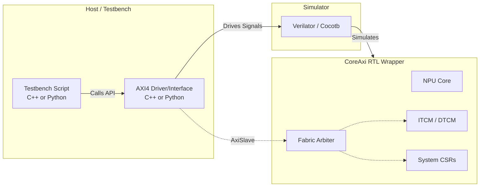
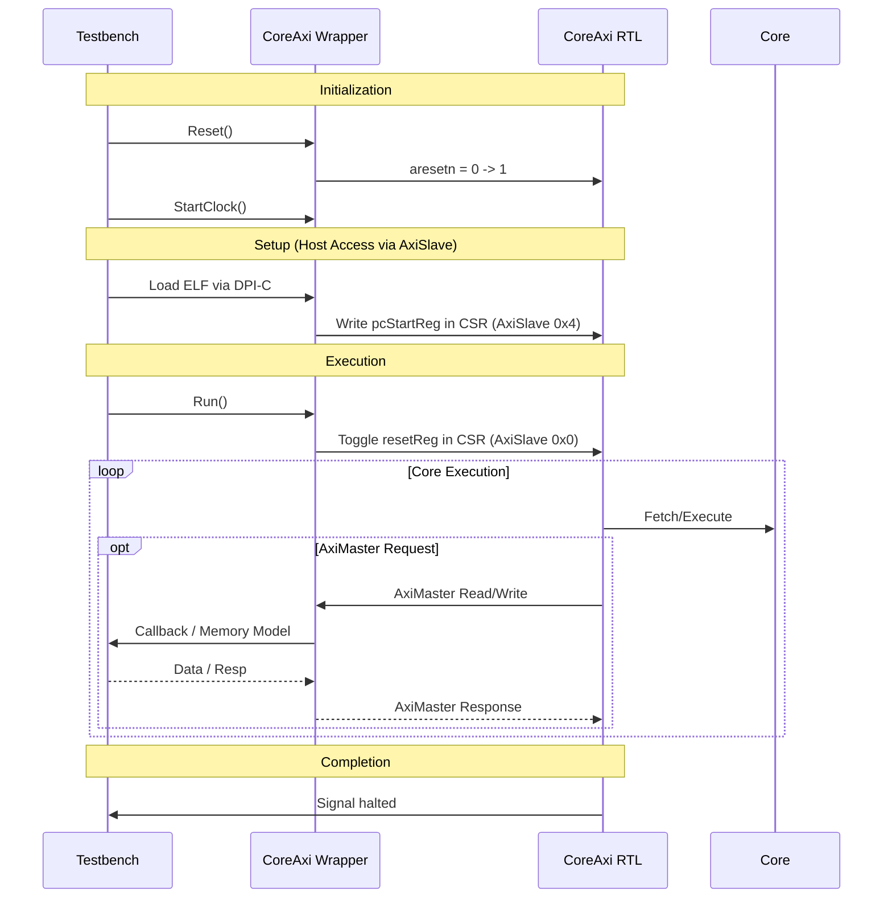
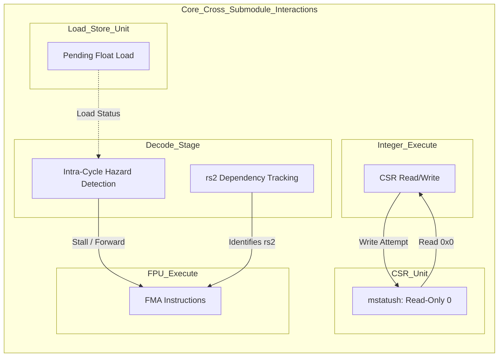

<!--
 Copyright 2026 Google LLC

 Licensed under the Apache License, Version 2.0 (the "License");
 you may not use this file except in compliance with the License.
 You may obtain a copy of the License at

     http://www.apache.org/licenses/LICENSE-2.0

 Unless required by applicable law or agreed to in writing, software
 distributed under the License is distributed on an "AS IS" BASIS,
 WITHOUT WARRANTIES OR CONDITIONS OF ANY KIND, either express or implied.
 See the License for the specific language governing permissions and
 limitations under the License.
-->

# Verification and Testing Architecture

> ⚠️ **Disclaimer:** This document was generated or modified by an AI model.
> While every effort is made to ensure technical accuracy, the underlying source
> code and hardware RTL implementation remain the absolute source of truth. Use
> at your own risk.

> **Intended Audience:** Hardware Developers, Verification Engineers

This document explicitly outlines the testing architecture and phase-gated
validation framework for the CoralNPU IP block.

## Validation Phase-Gated Architecture (ADR-026)

The validation framework follows a formal 6-phase architecture:

0. **Phase 0: ScalaTest & Direct-Pin-Toggle**: Early-stage block-level
   validation using Chisel ScalaTest and the `hw_sim/` C++ Direct-Pin-Toggle
   topology driving the standalone IP AXI interfaces, avoiding heavy simulation
   overhead (ADR-048).
1. **Phase 1: Block-Level Hardware Validation**: Isolated module testing
   (Cocotb/UVM SVE).
2. **Phase 2: Core-Level Functional Assembly**: ISA compliance (`riscv-tests`)
   using Cocotb + Verilator via `CoreMiniAxiInterface`.
   - **Static Reference Kernels (ADR-053)**: Includes the
     `static_reference_tests` package (`tests/cocotb/rvv/ml_ops/`), which
     provides locked-down, compile-time frozen matmul kernels (e.g.,
     `rvv_matmul` and `rvv_float_matmul` configured for `32x128x32`
     dimensions). These static kernels have fixed dimensions.
   - **Hazard and CSR Validation (ADR-040)**: Driven by
     `tests/cocotb/float_hazard_tests.S` (which compresses dependent float
     loads and FMA `rs2` usage into the same execution window to verify RAW
     hazard stall logic) and `tests/cocotb/csr_test_program.cc` (validating
     CSR-to-Execute read-only-zero constraints for `mstatush`).
3. **Phase 3: High-Fidelity Co-Simulation**: UVM + VCS + MPACT reference model
   (ADR-022). Uses `coralnpu_cosim_checker` to step MPACT in sync with retired
   instructions via RVVI.
4. **Phase 4: SoC-Level Integration**: Full chip model validation
   (Verilator/VCS) running FreeRTOS/MobileNet.
5. **Phase 5: Physical Sign-off**: VCS Static Netlist Simulation (DFT scan
   chains) utilizing shared filestore libraries via `vcs_cocotb_test` (ADR-036).
   This phase utilizes a 100% pure SystemVerilog testbench, formally
   deprecating legacy C++ SystemC wrappers (ADR-046), and leverages
   pre-compiled VCS model sharing and license queuing to optimize throughput
   and stability. Furthermore, the VCS test infrastructure supports
   cross-workspace execution by dynamically resolving pre-compiled VCS and
   Verilator model runfiles paths using the active workspace name passed via
   the `--main_workspace` flag. This enables external test targets (e.g.,
   `@netlist_test`) to seamlessly consume pre-compiled VCS models, resolving
   path normalization crashes during external repository integrations (ADR-102).
   It explicitly integrates Verilog model files by utilizing the
   `verilog_model_files` (`-v`) flag within the `vcs_cocotb_model` target
   (ADR-110).

## Core API/ABI Contracts for CoreAxi

The `CoreAxi` wrapper is driven by the following core ABI contracts:

- **CSR Contract (Base `0x30000` or `0x200000`)**:
  - `0x0`: Reset and Clock Gate control (Bit 0: Clock Gate, Bit 1: Reset).
  - `0x4`: Boot/Entry Point Address (`pcStart`).
  - `0x8`: Halt/Fault status.
- **AXI4 Contract**: Standard AXI4 with 32-bit addresses and 128/256-bit
  configurable data widths. Slave interface for Host access; Master interface
  for System Memory.
- **Backdoor Loading Contract**: DPI-C symbol `sram_backdoor_load_c` used for
  rapid ELF initialization across all testbenches.

## Test Infrastructure Topology

## Testbench to CoreAxi Interaction Flow

## Cross-Submodule Dependency Graph (ADR-040)

## Polymorphic ELF Loading Ecosystem (ADR-031)

ELF initialization dynamically toggles between two decoupled mechanisms via
lambda injections (e.g., `LoadElf(CopyFn)` in `elf.cc`):

- **Backdoor Fast-Path**: Driven by `coralnpu_test_utils/backdoor.py` and
  `sram_backdoor_load_c` (DPI-C), exclusively targeting `Sram.v` instances.
- **Standard AXI4 Path**: Driven by `CoreMiniAxiInterface.py` and the C++
  standalone IP AXI driver, mapping arbitrary address writes over AXI4.

### Dynamic SRAM Backdoor Scoping (ADR-118)

During Phase 5 VCS simulations, the SRAM backdoor DPI library
(`sram_backdoor.cc`) is scoped to specific HDL toplevels. As formalized in
`rules/sram_backdoor.bzl`, the `SRAM_BACKDOOR_TOPLEVELS` list restricts the
compilation and linking of the backdoor library exclusively to the following
supported HDL toplevels:

- `CoreMiniAxi`
- `RvvCoreMiniAxi`
- `RvvCoreMiniHighmemAxi`
- `RvvCoreMini_ITCM512KB_DTCM512KBAxi`
- `CoralNPUChiselSubsystemTestHarness`
- `CoralNPUChiselSubsystemHighmemTestHarness`

### DPI-C SRAM Backing Memory Interface (ADR-141)

During simulation in Verilator or VCS, the hardware SRAM block (`Sram.v`)
bypasses physical memory arrays in favor of a high-performance DPI-C backing
storage engine (`DPI_MEMORY`). This engine maps SRAM read and write
transactions directly to C++ host memory, enabling rapid memory state
initialization, tracking, and interception under the simulation layer.

The DPI-C backing interface is defined by the following SystemVerilog-to-C API
contracts:

- `sram_init(global_addr, size_bytes, width_bytes)`: Instantiates a backing
  memory region in host C++ memory and returns a handle (`chandle`). This is
  executed during the Verilog `initial` block using the target region's global
  base address and total size.
- `sram_read(handle, addr, rdata)`: Performs a synchronous or combinatorial
  lookup from the C++ backing store. On the rising edge of the simulation
  clock, if memory is enabled and not writing, the registered output is updated
  with 128 bits of data.
- `sram_write(handle, addr, wdata, wmask)`: Synchronously writes a 128-bit
  payload to the host-backed memory. On the rising edge of the simulation
  clock, if write is enabled, the data is written according to a 32-bit
  zero-extended byte-write mask (`wmask`).
- `sram_cleanup(handle)`: Safely destroys and deallocates the C++ backing
  memory instance upon simulation completion within Verilog's `final` block.

## UVM Reference Model (ADR-022)

Phase 3 validation leverages the MPACT reference model (not Spike) for
high-fidelity co-simulation within the UVM environment.

### Co-Simulation DPI-C ABI Contract (ADR-142)

The `coralnpu_cosim_dpi_if.sv` package establishes the rigid DPI-C ABI contract
between the SystemVerilog UVM testbench and the underlying MPACT C++ reference
model. This interface dictates how the UVM testbench synchronizes instruction
stepping and halts with the reference model.

Key synchronization and state extraction functions include:

- `mpact_init()`, `mpact_reset()`, `mpact_fini()`: Lifecycle management functions
  to initialize, reset, and cleanly terminate the MPACT simulator instance.
- `mpact_load_program(elf_file)`: Bootstraps the reference model by directly
  loading the target ELF binary.
- `mpact_step(instruction)`: Orchestrates the cycle-by-cycle execution of a
  single instruction within the reference model.
- `mpact_is_halted()`: Provides the halt synchronization mechanism, polling the
  C++ model to determine if the architectural state has reached a terminal
  condition.
- `mpact_get_register()` / `mpact_get_vector_register()`: Exposes the
  architectural state for UVM checker comparisons.
- `mpact_config(sim_config_t)`: Initializes architectural parameters such as
  ITCM boundaries and the `misa` register configuration.

### UVM Co-Simulation Checker (ADR-145)

The `coralnpu_cosim_checker` component, defined in
`tests/uvm/common/cosim/coralnpu_cosim_checker_pkg.sv`, acts as the primary
validation bridge in the Phase 3 environment. It intercepts the architectural
state retirements from the hardware pipeline via the RVVI (RISC-V Verification
Interface) and compares them cycle-by-cycle against the MPACT reference
model's state to detect any functional or architectural divergence.

Key high-level capabilities include:

- **Lock-step Comparison**: Validates program counter (PC) progression, scalar
  general-purpose registers (GPRs), and CSR updates.
- **Reference Model Stepping**: Synchronizes the state of the C++ reference
  model by stepping it in alignment with retired instructions.
- **Architectural Divergence Trap**: Immediately halts simulation and reports
  failure upon detecting mismatched architectural state.
- **Varying CSR Tracing**: Automatically detects instructions reading from
  varying hardware counters (e.g., `mcycle`, `cycle`, `time`). It flags the
  destination GPR as "dirty" to suppress false-positive mismatch errors between
  RTL and the reference model, as reference models cannot perfectly predict
  dynamic hardware timing metrics.
- **Stack GPR Tracing**: Tracks the lifecycle of dirty GPR data across stack
  spills and reloads. If a dirty varying CSR value is stored to the stack
  (byte-granular tracking) and subsequently reloaded into a different GPR, the
  checker correctly propagates the dirty mask to the new GPR to ensure
  continuity of comparison suppression.

For implementation details and configuration options, refer directly to
`tests/uvm/common/cosim/coralnpu_cosim_checker_pkg.sv`.

### Float Division Test Exclusions

Due to current inconsistencies regarding canonical NaN propagation between the
hardware and the MPACT reference model, all vector float division tests (across
all rounding modes) are explicitly excluded from the UVM regression suite
(`utils/run_uvm_regression.py`).

The excluded targets include:

- `//tests/cocotb/rvv/arithmetics:rvv_fdiv_float_*`
- `//tests/cocotb/rvv/arithmetics:vfdiv_vf_test_*`
- `//tests/cocotb/rvv/arithmetics:vfrdiv_vf_test_*`

These tests are quarantined until the MPACT reference model is updated to match
the RTL's exact canonical NaN rounding behaviors.

## TLUL Quarantine Policy (ADR-032, ADR-143)

While the CoralNPU RTL accurately implements TLUL ports to reflect
implementation reality, the primary standalone IP validation suite exclusively
utilizes the standard AXI4 interfaces. To enforce the strict standalone IP
boundary, testbench components that are exclusively bound to TLUL integration
are quarantined from the core verification ecosystem.

This explicit quarantine applies to:

- `TileLinkULInterface.py`
- `tests/cocotb/tlul/`

These components must not be invoked or relied upon for the standalone IP
verification sign-off process.

## SystemC/Verilator Components (ADR-028)

The `tests/verilator_sim/` directory provides a C++ and SystemC-based
simulation wrapper for Verilated RTL. It serves as a foundational component for
early-phase functional assembly and integration testing. Verilator compilation
stability and width safety constraints are ensured via proper include guards and
strict `WIDTHCONCAT` overrides (ADR-133):

- **`Sysc_tb` Base Class**: Defined in `sysc_tb.h`, this class provides an
  out-of-the-box SystemC module template for clock generation (`posedge`,
  `negedge` bindings), reset sequencing, and FST waveform tracing
  (`VerilatedFstC`).
- **Randomized Stimulus**: The framework provides constrained randomization
  utilities (`rand_bool`, `rand_int`) essential for generating randomized bus
  traffic during validation.
- **ELF Loading**: The directory contains `elf.cc` and `elf.h`, which provide the
  polymorphic ELF loading utilities detailed in ADR-031, allowing test binaries
  to be parsed and injected directly into simulation memories.
- **Legacy Instruction Trace (Deprecated)**: The legacy SystemC instruction
  trace framework defined in `tests/systemc/instruction_trace.h` has been
  formally deprecated (ADR-144) in favor of the pure SystemVerilog RVVI-based
  tracing mechanism.

## Simulation Entry Points (ADR-074)

The Phase 2 and 3 validation environments utilize three primary testbench entry
points, each serving a distinct ecosystem:

1. **`core_mini_axi_interface.py` (Cocotb / Python)**:
   - Provides a memory-mapped AXI4 interface simulator for the `EXTMEM` region
     (`0x20000000`) and TCMs.
   - Manages AXI4 Master/Slave interactions, DM CSR accesses, and interrupts.
   - Provides `load_elf_backdoor` (via DPI `sram_backdoor_load_c`) and
     `load_elf_axi` for dynamic ELF injection.
2. **`coralnpu_tb_top.sv` (SystemVerilog / UVM)**:
   - The top-level testbench module for UVM-based simulation.
   - Instantiates `RvvCoreMiniVerificationAxi` as the DUT.
   - Wires up standard AXI4 Master/Slave, IRQ, and RVVI (`rvviTrace`) interfaces
     for co-simulation.
   - Includes a native `tohost` monitor block for synchronization and test
     termination.
3. **`core_mini_axi_tb.cc` (SystemC / Verilator)**:
   - A high-performance C++ Verilator harness utilizing TLM-to-AXI4
     (`tlm2axi_bridge_`) and AXI4-to-TLM bridges.
   - Natively intercepts and services RISC-V `tohost` semihosting syscalls (e.g.,
     `sys_read`, `sys_write`, `sys_openat`) directly in C++ for maximum
     throughput.
   - Supports SystemC traffic generators and memory models.

## C++ Emulator Runner (CoralNPUSimulator) (ADR-140)

The `hw_sim/coralnpu_simulator.h` header defines the `CoralNPUSimulator` class,
providing a high-level C++ emulator abstraction driving the standalone IP AXI
interfaces. This interface encapsulates the internal combinatorial state and
Verilator setup boilerplate, presenting a clean testing contract.

Key public API contracts exposed to verification engineers include:

- `Run(uint64_t max_cycles)` / `WaitForTermination()`: High-level polling
  methods to sequence instruction execution and synchronize on halt conditions.
- `ReadTCM(...)` / `WriteTCM(...)`: Interception functions providing direct
  memory injection/extraction capabilities, crucial for rapidly verifying
  intermediate simulation state.
- `ReadMailbox()` / `WriteMailbox()`: Primitives for host-target communication
  during execution.

## GDB Server and Debug Module Implementation (ADR-035)

Interactive debugging of the CoralNPU IP is supported via a custom GDB server
bridge implemented in `coralnpu_test_utils/core_mini_axi_pyocd_gdbserver.py`.
This bridge enables standard GNU Debugger (GDB) clients to interact with the
simulated core's RISC-V Debug Module (DM) over TCP/IP sockets within the
Cocotb/Python environment.

### Register Mapping and Access Contracts

The bridge converts GDB protocol requests into Debug Module (DM) accesses.
Architectural registers are mapped to DM addresses as follows:

- **Program Counter (PC)**: Mapped to `0x7B1`.
- **Scalar General Purpose Registers (GPRs `x0`-`x31`)**: Mapped to `0x1000` to
  `0x101F`.
- **Floating-Point Registers (`f0`-`f31`)**: Mapped to `0x1020` to `0x103F`.
- **Floating-Point CSRs (`fflags`, `frm`, `fcsr`)**: Mapped to `0x1` to `0x3`.

### Debug Operations Flow

The GDB server bridge translates high-level debugger commands into low-level AXI
debug operations (`CoreMiniAxiDebugOps`) driving the DUT:

1. **Halt/Resume**: Triggers `dm_request_halt` or `dm_request_resume` over AXI.
2. **Memory Access**: Translates `READ_MEMORY_BLOCK8` / `WRITE_MEMORY_BLOCK8`
   into sequential AXI accesses (`dm_read_mem` / `dm_write_mem`) with variable
   access sizes (1, 2, or 4 bytes) depending on alignment.
3. **Breakpoints**: Implements `SET_BREAKPOINT` / `REMOVE_BREAKPOINT` by writing
   to DM registers (e.g., `0x7A0`, `0x7A1`, `0x7A2`) to configure hardware
   match triggers.
4. **Single Stepping**: Executes `STEP` by setting the single-step trigger in
   the DM.

> [!NOTE]
> The server dynamically binds to available TCP ports to avoid collisions in
> concurrent simulation environments. It automatically spawns and tears down the
> GDB client thread using temporary command files.

--------------------------------------------------------------------------------

> **Traceability:** Generated by Gemini. Derived from upstream commit 28fdd2f4b80b1db06a4025b828807fcdc0e76f88. AI-generated/assisted; RTL is the source of truth.
