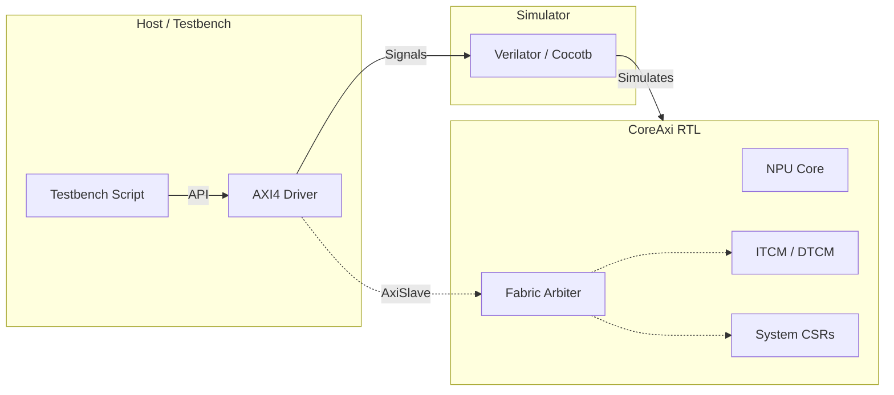
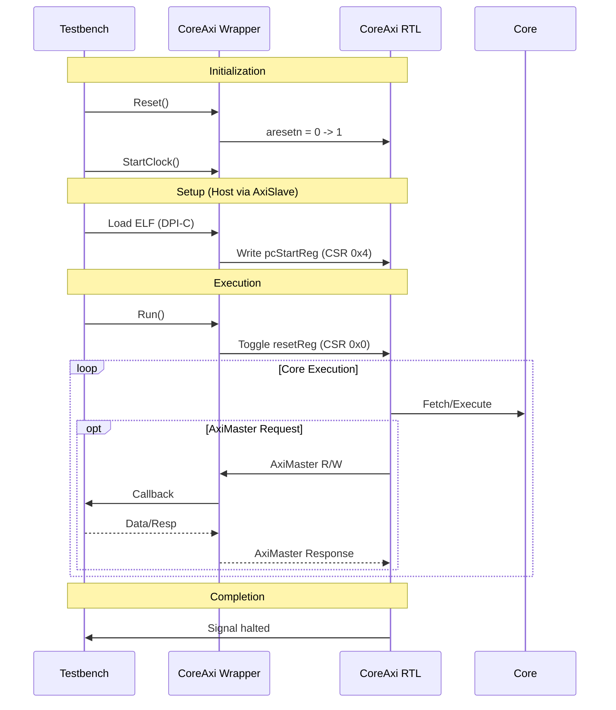
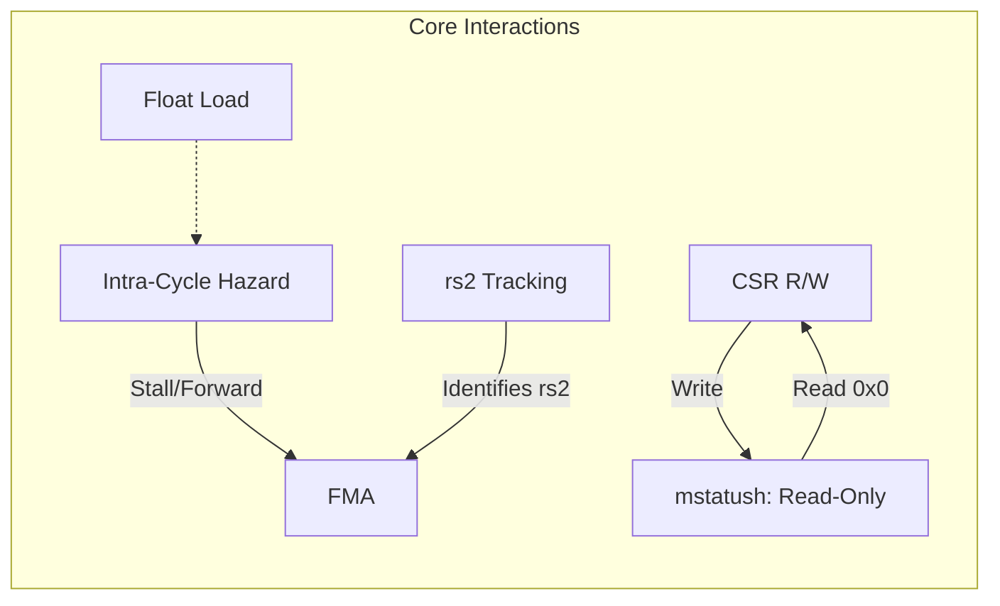

<!--
 Copyright 2026 Google LLC

 Licensed under the Apache License, Version 2.0 (the "License");
 you may not use this file except in compliance with the License.
 You may obtain a copy of the License at

     http://www.apache.org/licenses/LICENSE-2.0

 Unless required by applicable law or agreed to in writing, software
 distributed under the License is distributed on an "AS IS" BASIS,
 WITHOUT WARRANTIES OR CONDITIONS OF ANY KIND, either express or implied.
 See the License for the specific language governing permissions and
 limitations under the License.
-->

# Verification and Testing Architecture

> ⚠️ **Disclaimer:** This document was generated or modified by an AI model.
> While every effort is made to ensure technical accuracy, the underlying source
> code and hardware RTL implementation remain the absolute source of truth. Use
> at your own risk.

> **Intended Audience:** Hardware Developers, Verification Engineers

This document explicitly outlines the testing architecture and phase-gated
validation framework for the CoralNPU IP block.

## Validation Phase-Gated Architecture (ADR-026)

The validation framework follows a formal 6-phase architecture:

| Phase   | Description                          | Key Technologies             | Notes                                                                                                                                                                                                                                          |
| :------ | :----------------------------------- | :--------------------------- | :--------------------------------------------------------------------------------------------------------------------------------------------------------------------------------------------------------------------------------------------- |
| **0**   | ScalaTest & Direct-Pin-Toggle      | Chisel ScalaTest, hw_sim/    | Early-stage block-level validation with direct IP AXI interfaces (ADR-048).                                                                                                                                                                     |
| **1**   | Block-Level Hardware Validation      | Cocotb/UVM SVE             | Isolated module testing.                                                                                                                                                                                                                       |
| **2**   | Core-Level Functional Assembly     | Cocotb + Verilator           | ISA compliance (`riscv-tests`) via `CoreMiniAxiInterface`. Includes static reference kernels (`static_reference_tests`) and hazard/CSR validation (`float_hazard_tests.S`, `csr_test_program.cc`) (ADR-053, ADR-040). |
| **3**   | High-Fidelity Co-Simulation        | UVM + VCS + MPACT            | Co-simulates MPACT reference model with RTL via RVVI using `coralnpu_cosim_checker` (ADR-022).                                                                                                                                          |
| **4**   | SoC-Level Integration              | Verilator/VCS                | Full chip model validation running FreeRTOS/MobileNet.                                                                                                                                                                                         |
| **5**   | Physical Sign-off                  | VCS Static Netlist           | DFT scan chain validation using SystemVerilog testbench. Deprecates legacy SystemC wrappers (ADR-046). Leverages pre-compiled VCS models and supports cross-workspace execution (ADR-102, ADR-110).                                             |

## Core API/ABI Contracts for CoreAxi

The `CoreAxi` wrapper adheres to:

- **CSR Contract**: Memory-mapped interface at base `0x30000` or `0x200000`.
  - `0x0`: Reset & Clock Gate.
  - `0x4`: Boot Address (`pcStart`).
  - `0x8`: Halt/Fault status.
- **AXI4 Contract**: Standard AXI4 (32-bit addresses, 128/256-bit data).
- **Backdoor Loading**: DPI-C `sram_backdoor_load_c` for ELF initialization.

## Test Infrastructure Topology

## Testbench to CoreAxi Interaction Flow

## Cross-Submodule Dependency Graph (ADR-040)

## Polymorphic ELF Loading Ecosystem (ADR-031)

ELF initialization uses two mechanisms:

- **Backdoor Fast-Path**: Via `coralnpu_test_utils/backdoor.py` and DPI-C `sram_backdoor_load_c` targeting `Sram.v`.
- **Standard AXI4 Path**: Via `CoreMiniAxiInterface.py` and C++ AXI driver.

### Dynamic SRAM Backdoor Scoping (ADR-118)

DPI library `sram_backdoor.cc` is restricted to: `CoreMiniAxi`, `RvvCoreMiniAxi`, `RvvCoreMiniHighmemAxi`, `RvvCoreMini_ITCM512KB_DTCM512KBAxi`, `CoralNPUChiselSubsystemTestHarness`, `CoralNPUChiselSubsystemHighmemTestHarness`.

### DPI-C SRAM Backing Memory Interface (ADR-141)

`Sram.v` uses DPI-C for host memory backing:

- `sram_init(global_addr, size_bytes, width_bytes)`
- `sram_read(handle, addr, rdata)`
- `sram_write(handle, addr, wdata, wmask)`
- `sram_cleanup(handle)`

## UVM Reference Model (ADR-022)

Phase 3 uses MPACT for co-simulation.

### Co-Simulation DPI-C ABI Contract (ADR-142)

`coralnpu_cosim_dpi_if.sv` defines the DPI-C ABI for synchronizing RTL with MPACT. Key functions:

- `mpact_init()`, `mpact_reset()`, `mpact_fini()`
- `mpact_load_program(elf_file)`
- `mpact_step(instruction)`
- `mpact_is_halted()`
- `mpact_get_register()` / `mpact_get_vector_register()`
- `mpact_config(sim_config_t)`

### UVM Co-Simulation Checker (ADR-145)

`coralnpu_cosim_checker` (in `tests/uvm/common/cosim/coralnpu_cosim_checker_pkg.sv`) compares RTL state against MPACT via RVVI. It handles:

-   Lock-step PC, GPR, and CSR validation.
-   Reference model stepping.
-   Architectural divergence traps.
-   Varying CSR tracing to suppress false mismatches.
-   Stack GPR tracking for dirty values.

## Float Division Test Exclusions

Vector float division tests are excluded from UVM due to NaN inconsistencies between hardware and MPACT (see `utils/run_uvm_regression.py`):

- `//tests/cocotb/rvv/arithmetics:rvv_fdiv_float_*`
- `//tests/cocotb/rvv/arithmetics:vfdiv_vf_test_*`
- `//tests/cocotb/rvv/arithmetics:vfrdiv_vf_test_*`

## TLUL Quarantine Policy (ADR-032, ADR-143)

TLUL test components (`TileLinkULInterface.py`, `tests/cocotb/tlul/`) are quarantined from standalone IP verification.

## SystemC/Verilator Components (ADR-028)

`tests/verilator_sim/` provides a C++/SystemC wrapper for Verilated RTL.

- **`Sysc_tb`**: Base class (`sysc_tb.h`) for clock/reset generation and FST tracing.
- **Randomized Stimulus**: Utilities (`rand_bool`, `rand_int`).
- **ELF Loading**: `elf.cc`/`elf.h` provide polymorphic ELF loading.
- **Legacy Instruction Trace**: Deprecated in favor of RVVI tracing (ADR-144).

## Simulation Entry Points (ADR-074)

Phase 2 & 3 use:

1.  **`core_mini_axi_interface.py`**: Cocotb/Python AXI4 interface.
2.  **`coralnpu_tb_top.sv`**: SystemVerilog/UVM top-level testbench.
3.  **`core_mini_axi_tb.cc`**: SystemC/Verilator C++ harness with semihosting support.

## C++ Emulator Runner (CoralNPUSimulator) (ADR-140)

`hw_sim/coralnpu_simulator.h` provides `CoralNPUSimulator`:

- `Run()`, `WaitForTermination()`
- `ReadTCM()`, `WriteTCM()`
- `ReadMailbox()`, `WriteMailbox()`

## GDB Server and Debug Module (ADR-035)

`coralnpu_test_utils/core_mini_axi_pyocd_gdbserver.py` enables GDB debugging via AXI Debug Module (DM).

### Register Mapping

-   **PC**: `0x7B1`
-   **GPRs**: `0x1000` - `0x101F`
-   **FPRs**: `0x1020` - `0x103F`
-   **F-CSRs**: `0x1` - `0x3`

### Debug Operations

Translates GDB commands to AXI DM accesses: Halt/Resume, Memory Access, Breakpoints, Single Stepping.

> [!NOTE]
> The server dynamically binds to TCP ports.

--------------------------------------------------------------------------------

**Provenance & Traceability** - **Verified As Of:** 2026-07-23 - **Upstream Commit:** 5c2647afd951f70d6244ea06b5a8b7fa1fdf2918 - **Primary Source(s):** `doc/verification.md` - **Disclaimer:** AI-generated/assisted; RTL is the source of truth.
